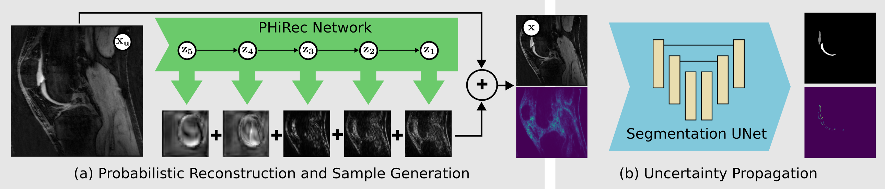
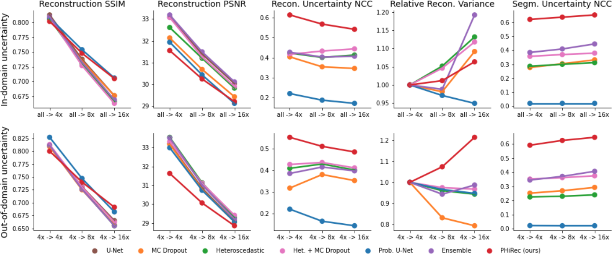
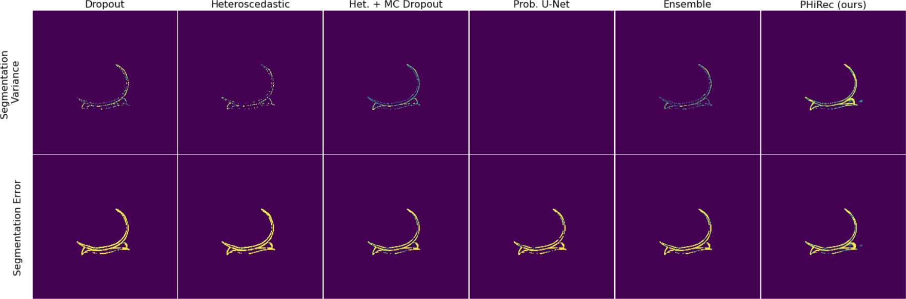

# PHiRec
## Uncertainty Estimation and Propagation in Accelerated MRI Reconstruction

Official implementation for the UNSURE@MICCAI2023 workshop paper: **Uncertainty Estimation and Propagation in Accelerated MRI Reconstruction**
[Arxiv Paper]() 

## Model overview
<div style="displaystyle=block;align=center;"><p align="center" >
  
  </p>
</div>

## Results

### Metric comparison
<div style="displaystyle=block;align=center;"><p align="center" >
  
  </p>
</div>

### Uncertainty propagation
<div style="displaystyle=block;align=center;"><p align="center" >
  
  </p>
</div>


## Installation
```
conda create --name phirec --file requirements.txt
```

## Datasets
We perform all trainings and evaluations on the Stanford Knee MRI Multi-Task Evaluation (SKM-TEA) Dataset. 

**SKM-TEA** (https://github.com/StanfordMIMI/skm-tea)

# Usage
The folder [examples](examples/) contains training and evaluation examples for all the models that we compare against each other. 

# References
If you use any of the code in this repository for your research, please cite as:
```
  @misc{fischer2023mruq,
      title={Uncertainty Estimation and Propagation in Accelerated MRI Reconstruction}, 
      author={Fischer, Paul and Küstner, Thomas and Baumgartner, Christian F.},
      year={2023},
      eprint={},
      archivePrefix={arXiv},
      primaryClass={cs.CV}
}
```